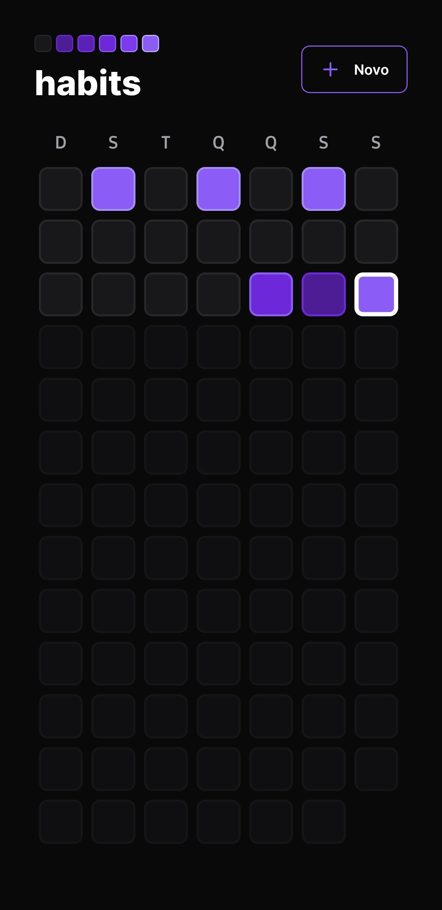
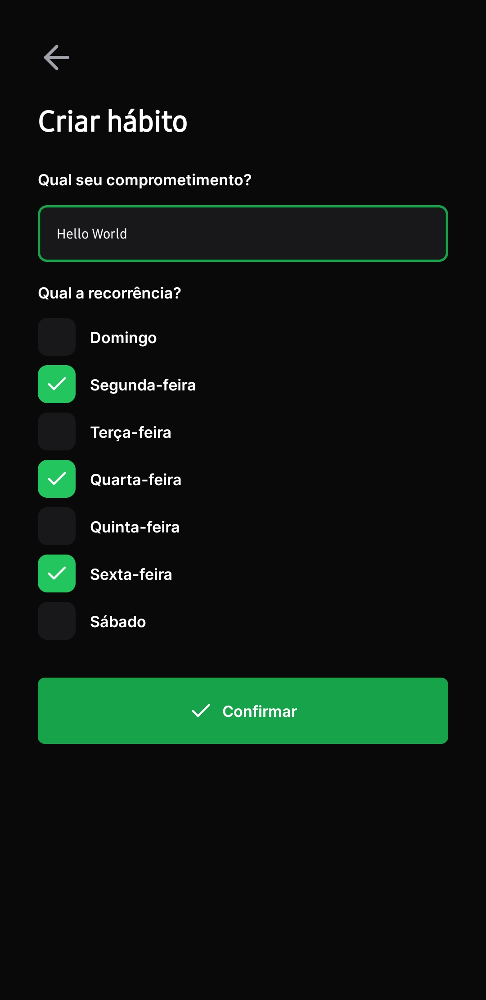
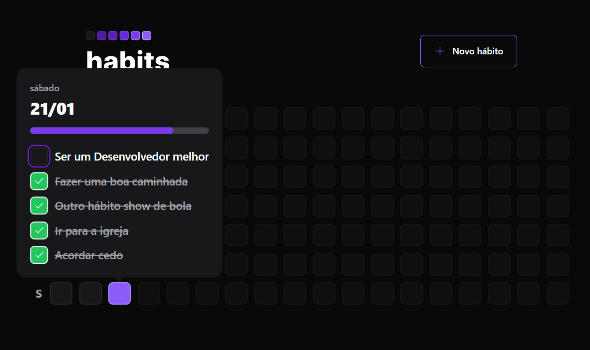

<h1 align="center">NLW Setup [Ignite]</h1>

Vamos desenvolver uma aplicação completa, de ponta a ponta, usando `TypeScript`, usando `Node.JS`, `React.JS`, `React Native`.

- **Node.JS**: Em resumo leva JS para o Backend, nos possibilta conexão com banco de dados, criação de API's completas, e ainda é possível usar para `IoT`;
- **TS**: TypeScript é um superset (não um framework) do JS que traz a tipagem estática ao JS, melhor inteligência e identificação de erros em nível de código antes do projeto ir para produção;

<h3 align="center">Preview Mobile</h3>

  
  
  

<h3 align="center">Preview Web</h3>

